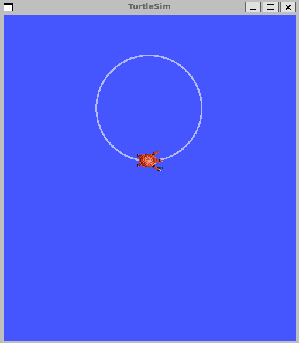

# My First Autonomous Robot

Today I wrote my own ROS2 node that controls the robot automatically.

Instead of using keyboard teleoperation, I created a **publisher node** that sends velocity commands to the turtle.

The node publishes to the topic:

/turtle1/cmd_vel

Message Type:
geometry_msgs/msg/Twist

Understanding:

* linear.x controls forward motion
* angular.z controls rotation

By continuously publishing velocity messages using a timer, the turtle moves in a circular path.

This helped me understand that robots move because a control program continuously sends motion commands, not because of a single instruction.

This is the same principle used in real robots like mobile robots and delivery robots.

What I learned:

* ROS2 Publisher
* Twist messages
* Timers in ROS2
* Autonomous motion control

Next Goal:
Make the robot change direction and create patterns.

— Shahsad
