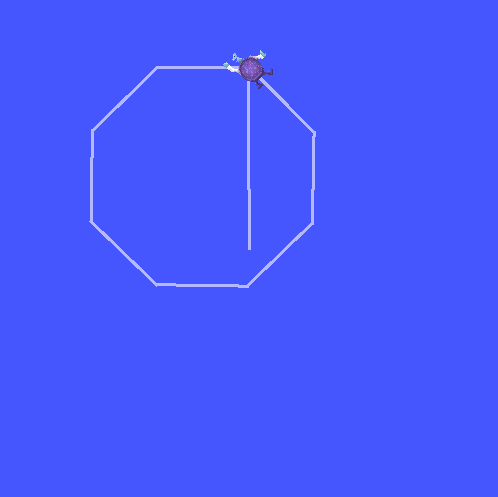

# My First Robot Simulation (Turtlesim)

Today I ran my first robot simulation using ROS2.

Turtlesim is a simple simulator in ROS2 that helps understand how robots communicate internally.

What I understood:

**Node**
A node is a small program in ROS2.
Example:

* turtlesim_node → creates the turtle robot
* turtle_teleop_key → sends movement commands

**Topic**
Nodes communicate using topics.

The keyboard node publishes movement instructions to:

`/turtle1/cmd_vel`

The turtle node subscribes to it and moves.

**Publisher & Subscriber**

* teleop = publisher (sends commands)
* turtle = subscriber (receives commands)

So the robot moves because two programs talk to each other.

This helped me understand that a robot is not one big program, but many small programs communicating.

Next Goal:
Create my own ROS2 node instead of using an existing one.
